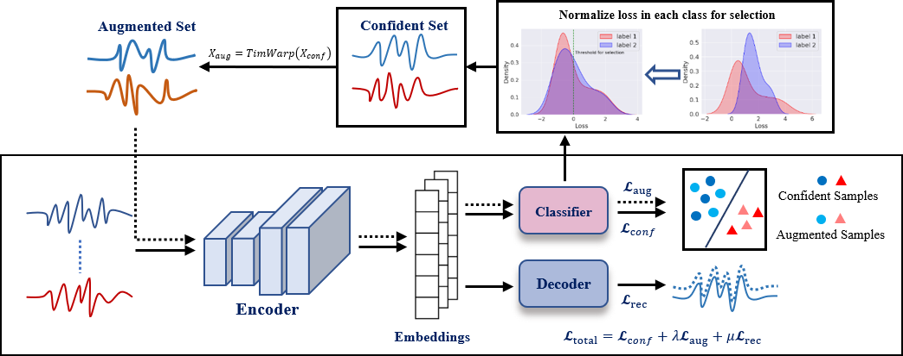

# CTW: Confident Time-Warping for Time-Series Label-Noise Learning

This is the training code for our work "CTW: Confident Time-Warping for Time-Series Label-Noise Learning"

## Abstract
Noisy labels seriously degrade the generalization ability of Deep Neural Networks (DNNs) various classification tasks. Existing studies on label-noise learning mainly focus on computer vision. However, time series also suffer from the same issue. Directly applying the methods from computer vision to time series may reduce the temporal dependency due to different data characteristics. How to make use of the properties of time series to enable DNNs to learn robust representations in the presence of noisy labels has not been fully explored. To this end, this paper proposes a method that expands the distribution of \textbf{C}onfident instances by \textbf{T}ime-\textbf{W}arping (CTW) to learn robust representations of time series. Specifically, since applying the augmentation method to all data may introduce extra mislabeled data, we select confident instances to implement Time-Warping. In addition, we normalize the distribution of the training loss of each class to eliminate the model's selection preference for instances of different classes, alleviating the class imbalance caused by sample selection. Extensive experimental results show that CTW achieves state-of-the-art performance on the UCR datasets when dealing with different types of noise. Besides, the t-SNE visualization of our method verifies that augmenting clean data improves the generalization ability.

<div align="center">

</div>

## Data
We evaluate our model on publicly available time-series classification datasets from the UCR and UEA repositories:

[The UCR time series archive](https://ieeexplore.ieee.org/abstract/document/8894743)

[The UEA multivariate time series classification archive, 2018](https://arxiv.org/abs/1811.00075)

All datasets are downloaded automatically during training if they do not exist.

## Requirements
The packages our code depends on are in ```./requirements.txt```.

## Usage
To train CTW on 13 benchmark datasets mentioned in this paper, run
```bash
nohup python ./src/main.py --model CTW --epochs 300 --lr 1e-3 --label_noise 0 --embedding_size 32 --ni 0.3 --num_workers 1 --mean_loss_len 10 --gamma 0.3 --cuda_device 0 --outfile CTW.csv >/dev/null 2>&1 &
```
The results are put in ```./statistic_results/```. 
(P.S. The evaluation process of CTW is at *line 231* in ./src/utils/training_helper_CTW.py )

For other examples, please refer to ```./run_sym30.sh```.


## Acknowledgement
We adapted the following open-source code to implement the state-of-the-art algorithms to compare CTW:
* [SIGUA](https://github.com/bhanML/SIGUA)
* [Co-teaching](https://github.com/bhanML/Co-teaching) 
* [MixUp and MixUp-GMM](https://github.com/PaulAlbert31/LabelNoiseCorrection)
* [SREA](https://github.com/Castel44/SREA)
* [Dividemix](https://github.com/LiJunnan1992/DivideMix)
* [Sel-CL](https://github.com/ShikunLi/Sel-CL)
